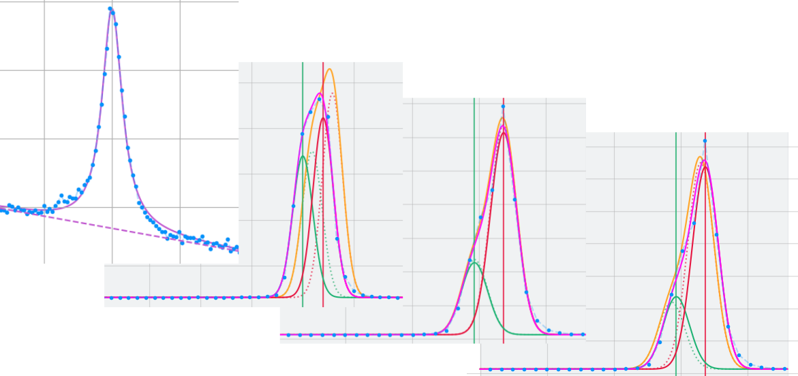

# Photoluminescence and Electroluminescence Fitting Toolbox (PEFT)

<p align="center">
  
</p>

- Author : Léo J. Roche  ([leoroche2@gmail.com](leoroche2@gmail.com))
- Affiliation : Technische Universität Berlin (TUB), AG Reitzenstein
- Version : 1 (MPL 7)
- [Documentation link](https://leojroche.github.io/PEFT/doc/index.html)
- Demonstration notebook available at `demo/demo.ipynb` ([link](https://github.com/leojroche/PEFT/blob/main/demo/demo.ipynb))

## Description

PEFT a toolbox written in Python that can be used to easily visualize and perform advanced fitting of spectra resulting from photoluminescence or electroluminescence measurements.
Single spectra or series of spectra corresponding to power or current excitation variations can be loaded. 
They can then be fitted using the available functions listed below. 
The fitting process of consequent series is sped-up by feeding the result from each previously fitted spectrum to the currently fitted spectrum as guess value.
This toolbox is adequate for the quick fitting and visualization of freshly acquired data, as well as for the processing of results for scientific publications.

The available fitting functions are :
- Voigt profile (no background, constant background or linear background)
- double Voigt profile 
- Gaussian function
- double Gaussian function

Examples of the type of measurements that can be processed: 
- **single spectrum**
- **power/current series** (several spectra acquired under varied injection currents/powers)
- **several power/current series** (several series measured one after another)
- **Stark-Tuning series** (several spectra acquired under varied bias voltages)

The toolbox is structures around three main classes : 
- `Spectrum` : contains the data of a single spectrum : intensities, wavelengths and power/current
- `Serie` : contains several `Spectrum`s
- `Series` : contains several `Series`s

Each of the three types of object can be directly fitted, without having to fit each `Spectrum` one by one.
Moreover, the toolbox relies on the use of a description file named `measurements_infos.json`. 
This file should be present in the directory of measurements files, informing the toolbox on the type of measurements present in the directory as well as in the subdirectories.
During the loading of a measurement file, the corresponding `measurement_infos.json` file is searched for (closest in path) in order to read the measurement files in the right way.
If a new file format has to be implemented, a new use case can be added in the construction method of the corresponding `Spectrum`, `Serie` or `Series` classes, and the corresponding keyword has to be referenced in the `measurement_infos.json` file, carefully placed in the measurement directory.

## How to install 

Download the current repository :
```bash
git clone https://github.com/leojroche/PEFT.git
cd PEFT
```

Create and activate a virtual environment :
```bash
python -m venv my_env
source my_env/bin/activate
```

Install the required dependencies : 
```bash
pip install -r python_requirements.txt
```

## How to use 

We recommend to use the toolbox within a Jupyter notebook (for example with Visual Code Studio) for convenience.
The following code, also found in `demo/demo.ipynb` with the results, presents a straightforward example of how to load and fit measurements.
Modes are fitted using Voigt profile and the results are plotted.
More detailed information are available in the documentation ([link](https://leojroche.github.io/PEFT/doc/index.html))

### imports
```python
import sys
sys.path.insert(0,'../')
import matplotlib.pyplot as plt
from spectrum import *
from series import *
from spectrum import *
from tools import *
```

### Spectrum
```python
s = Spectrum('spectrum/stepandglue/')
s.plot()
s.plot(lambda_min = 884, lambda_max=886)
voigt_fit = s.fit(lambda0_guess=885, delta_lambda=2, plot=True)
print(voigt_fit)
```

### Serie
```python
# load Serie
FILEPATH = 'series/Iscan_1.tdms'
serie = Serie(FILEPATH)

# plot Serie
serie.plot()
plot_each_fit = True
serie.fit(lambda0_guess = 855.2, delta_lambda = .3, plot = plot_each_fit)

# plot fit results
df_fits = serie.get_fit_results()
plt.figure()
plt.loglog(df_fits['x'], df_fits['a'], '.')
plt.xlabel('Power/Current (a.u.)')
plt.ylabel('Voigt profile amplitude (a.u.)')

plt.figure()
plt.loglog(df_fits['x'], df_fits['f_v'], '.')
plt.xlabel('Power/Current (a.u.)')
plt.ylabel('Voigt profile linewidth [nm]')
```

### Serie
```python
# load Series
FILEPATHS = ['series/Iscan_1.tdms', 'series/Iscan_2.tdms', 'series/Iscan_3.tdms']
series = Series(FILEPATHS, stitch=False)

# manual stitching
OD, exposure_time = 2, 3
series.series[0].scale_intensity(10**(OD))
series.series[0].scale_intensity(1/exposure_time)
OD, exposure_time = 0.45, 1.5
series.series[1].scale_intensity(10**(OD))
series.series[1].scale_intensity(1/exposure_time)
OD, exposure_time = 0, 1.28
series.series[2].scale_intensity(10**(OD))
series.series[2].scale_intensity(1/exposure_time)

# plot Series
series.plot()

# fit with Voigt profile 
plot_each_fit = True
series.fit(lambda0_guess = 855.2, x_min = 645, delta_lambda = .3, plot = plot_each_fit)
series.fit(lambda0_guess = 854.9, x_min = 400, x_max = 645, delta_lambda = .3, plot = plot_each_fit)
series.fit(lambda0_guess = 854.9, x_min = 1, x_max = 400, delta_lambda = .5, plot = plot_each_fit)

# plot fit results
df_fits = series.get_fit_results()
plt.figure()
plt.loglog(df_fits['x'], df_fits['a'], '.')
plt.xlabel('Power/Current (a.u.)')
plt.ylabel('Voigt profile amplitude (a.u.)')

plt.figure()
plt.loglog(df_fits['x'], df_fits['f_v'], '.')
plt.xlabel('Power/Current (a.u.)')
plt.ylabel('Voigt profile linewidth [nm]')
```

